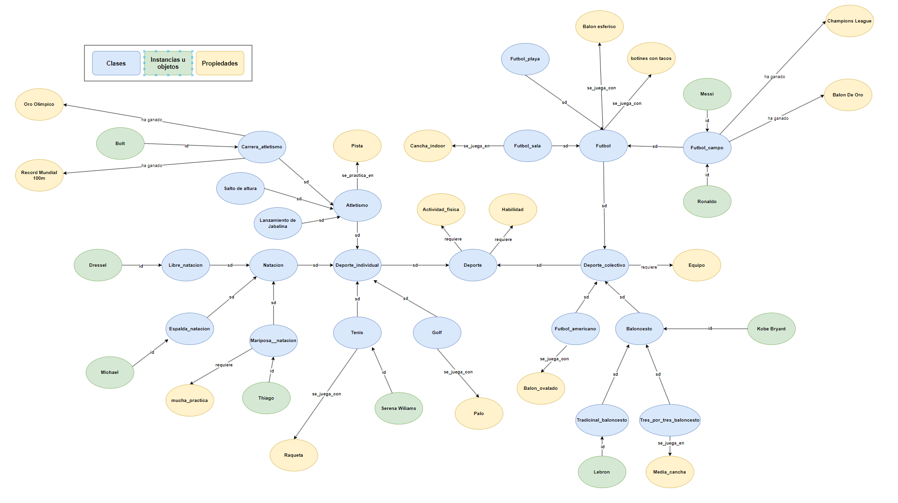

# Manual Tecnico

Este manual técnico describe el desarrollo de una red semántica utilizando el lenguaje de programación Prolog, como parte de la Práctica 2 de la asignatura de Inteligencia Artificial 1 en la Universidad San Carlos de Guatemala. El objetivo es aplicar los conocimientos adquiridos sobre redes semánticas para crear una red funcional y bien estructurada.

## Descripcion de la Practica

La práctica consiste en la construcción de una red semántica con al menos 30 nodos, utilizando diversas etiquetas y reglas para representar relaciones entre los nodos. El proyecto se desarrolla en Prolog, un lenguaje de programación lógico ideal para este tipo de tareas debido a su capacidad para manejar reglas y relaciones.

## Herramientas Utilizadas

* Lenguaje de Programación: Prolog
* Editor de Código: [Visual Studio Code, SWI-Prolog]
* Sistema de Control de Versiones: Git
* Repositorio: GitHub 

## Implementacion de la Red Semantica



Hechos

Se definen instancias de atletas y objetos relacionados con deportes, así como sus logros:

```prolog

% Instancias de atletas y objetos relacionados con deportes
instancia_de(messi, futbol_campo).
instancia_de(ronaldo, futbol_campo).
instancia_de(lebron, tradicional_baloncesto).
instancia_de(kobe_bryant, tradicional_baloncesto).
instancia_de(bolt, carrera_atletismo).
instancia_de(dressel, libre_natacion).
instancia_de(michael, espalda_natacion).
instancia_de(thiago, mariposa_natacion).


```

Subclases

Se definen las subclases de deportes:

```prolog
% Subclases de deportes
subclase_de(deporte_individual, deporte).
subclase_de(deporte_colectivo, deporte).
subclase_de(atletismo, deporte_individual).
subclase_de(carrera_atletismo, atletismo).
subclase_de(salto_de_altura, atletismo).
subclase_de(lanzamiento_jabalina, atletismo).
subclase_de(natacion, deporte_individual).
subclase_de(libre_natacion, natacion).
subclase_de(espalda_natacion, natacion).
subclase_de(mariposa_natacion, natacion).
subclase_de(tenis, deporte_individual).
subclase_de(golf, deporte_individual).
subclase_de(futbol, deporte_colectivo).
subclase_de(futbol_sala, futbol).
subclase_de(futbol_campo, futbol).
subclase_de(futbol_americano, deporte_colectivo).
subclase_de(baloncesto, deporte_colectivo).
subclase_de(tradicional_baloncesto, baloncesto).
subclase_de(tres_por_tres_baloncesto, baloncesto).


```


Propiedades

Se definen las propiedades específicas de las clases:

```prolog
% Propiedades específicas de clases
tiene_propiedad(deporte, requiere, actividad_fisica).
tiene_propiedad(deporte, requiere, habilidad).
tiene_propiedad(deporte_colectivo, requiere, equipo).
tiene_propiedad(futbol_sala, se_juega_en, cancha_indoor).
tiene_propiedad(futbol_americano, se_juega_con, balon_ovalado).
tiene_propiedad(tres_por_tres_baloncesto, se_juega_en, media_cancha).
tiene_propiedad(atletismo, se_practica_en, pista).
tiene_propiedad(tenis, se_juega_con, raqueta).
tiene_propiedad(golf, se_juega_con, palo).
tiene_propiedad(mariposa_natacion, requiere, mucha_practica).
tiene_propiedad(futbol, se_juega_con, balon_esferico).
tiene_propiedad(futbol, se_juega_con, botines_con_tacos).
tiene_propiedad(futbol_playa, se_juega_en, playa).
tiene_propiedad(futbol_campo, ha_ganado, champions_league).
tiene_propiedad(futbol_bampo, ha_ganado, balon_oro).
tiene_propiedad(carrera_atletismo, ha_ganado, oro_olimpico).
tiene_propiedad(carrera_atletismo, ha_ganado, record_mundial_100mts).

```

Reglas

Se implementaron varias reglas para operar sobre la red semántica:

1. Regla para verificar si un objeto es una instancia de una clase:

```prolog
es(Clase, Obj) :-
    instancia_de(Obj, Clase).
es(Clase, Obj) :-
    instancia_de(Obj, Clasep),
    subc(Clasep, Clase).


```

2. Regla para verificar si una clase es subclase de otra:

```prolog
subc(C1, C2) :-
    subclase_de(C1, C2).
subc(C1, C2) :-
    subclase_de(C1, C3),
    subc(C3, C2).

```

3. Regla para determinar las propiedades de un objeto:

```prolog
propiedad(Obj, Prop) :-
    es(Clase, Obj),
    tiene_propiedad(Clase, Propiedad, Clase2),
    Prop =.. [Propiedad, Clase2].


```


## Pruebas y Validacion

Se realizaron diversas pruebas para asegurar el correcto funcionamiento de la red semántica. A continuación, se presenta un ejemplo de prueba:

```prolog
% Prueba para verificar instancia
?- es(futbol, messi).
true.

% Prueba para verificar subclase
?- subc(futbol, deporte).
true.

% Prueba para listar propiedades
?- propiedad(futbol_sala, Propiedad).
Propiedad = se_juega_en(cancha_indoor).

```
