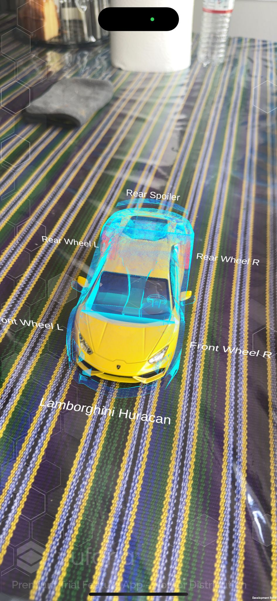

# Manual de Usuario

## Introduccion

Esta aplicación está diseñada para identificar un objeto específico a través de la cámara de su dispositivo móvil, resaltar el objeto y mostrar sus partes principales. La aplicación ofrece una experiencia interactiva y educativa, facilitando el reconocimiento de objetos y la visualización de información relevante de manera intuitiva y accesible.

Este manual de usuario proporciona instrucciones claras y sencillas para la instalación, configuración y uso de la aplicación. Está destinado a usuarios con diversos niveles de experiencia en el uso de aplicaciones móviles y tecnologías AR. 

## Requisitos previos

* Un dispositivo iOS compatible (iPhone o iPad con iOS 11.0 o superior).
* Espacio suficiente en el dispositivo para instalar la aplicación.

## Instalacion de aplicacion

* Obtener el Archivo de la Aplicación (IPA)
    * Asegúrese de tener el archivo de la aplicación (IPA) proporcionado por el desarrollador.

* Instalar la Aplicación Usando TestFlight
    * `Paso 1`: Descargue e instale TestFlight desde la App Store en su dispositivo iOS.
    * `Paso 2`: Abra TestFlight y acepte la invitación para probar la aplicación. La invitación debería haber sido enviada por correo electrónico.
    * `Paso 3`: Una vez aceptada la invitación, la aplicación aparecerá en TestFlight. Haga clic en "Instalar" para descargar e instalar la aplicación en su dispositivo.

## Permisos necesarios

* Permitir Acceso a la Cámara
    * Al abrir la aplicación por primera vez, se le solicitará permiso para acceder a la cámara del dispositivo. Esto es necesario para que la aplicación pueda identificar el objeto a través de la cámara.
    * Paso 1: Cuando aparezca la solicitud de permiso, seleccione "Permitir" para otorgar acceso a la cámara.
    * Paso 2: Si accidentalmente deniega el permiso, puede habilitarlo manualmente yendo a Configuración > Privacidad > Cámara y activando el interruptor para la aplicación.

## Uso de la aplicacion

* Iniciar la Aplicación
    * Toque el ícono de la aplicación en la pantalla de inicio de su dispositivo para abrirla.
    * Siga las instrucciones en pantalla para configuraciones iniciales si es necesario.

* Identificar el Objeto
    * Apunte la cámara de su dispositivo hacia el objeto que desea identificar.
    * La aplicación comenzará a procesar la imagen y a identificar el objeto.
    * Una vez identificado, el objeto será resaltado en la pantalla.

* Visualizar Partes del Objeto

    * La aplicación mostrará las partes destacadas del objeto.

## Solucion de problemas comunes

* La aplicación no reconoce el objeto:
    * Asegúrese de que el objeto esté bien iluminado y visible.
    * Verifique que la cámara esté enfocada correctamente.

* La cámara no funciona en la aplicación:
    * Verifique que la aplicación tenga permiso para acceder a la cámara (Configuración > Privacidad > Cámara).
    * Cierre y vuelva a abrir la aplicación.

## Desinstalar la Aplicación

* Para desinstalar la aplicación, mantenga presionado el ícono de la aplicación en la pantalla de inicio.
* Seleccione "Eliminar aplicación" y confirme cuando se le solicite.

## Resultado Final

